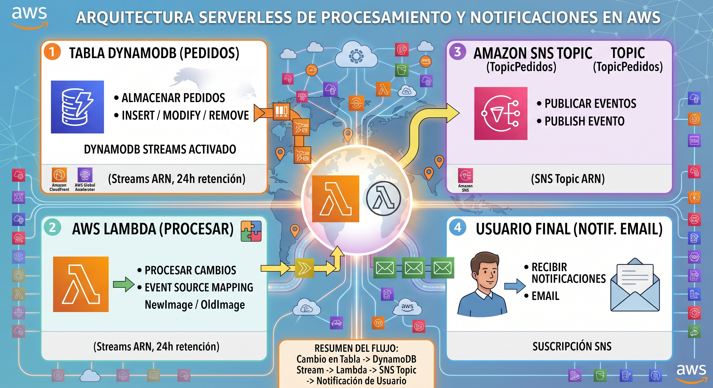

# 🔄 Proyecto Real Time #1 — DynamoDB Streams + Lambda + SNS

> 📦 Arquitectura orientada a eventos que captura cambios (CDC) sobre una tabla de **DynamoDB** mediante **DynamoDB Streams**, los procesa con **AWS Lambda** y notifica a los usuarios finales por correo electrónico a través de **Amazon SNS**.


---

## 📌 Contexto

El proyecto consiste en construir una arquitectura basada en eventos (**Event-Driven Architecture**) que analiza los cambios ocurridos dentro de una tabla de DynamoDB, aprovechando el feature nativo **DynamoDB Streams**, el cual ejecuta un adecuado **Change Data Capture (CDC)** dentro de AWS.

Estos eventos son procesados por una función **Lambda**, la cual —tras identificar el cambio— publica un mensaje en un **tópico de SNS**, encargado de enviar la notificación por correo electrónico a los usuarios finales.

### 🏗️ Arquitectura



**Flujo:** `INSERT / MODIFY / REMOVE` en la tabla → DynamoDB Streams registra el cambio (24h de retención) → Event Source Mapping dispara la Lambda → Lambda procesa el registro (`NewImage` / `OldImage`) → Lambda publica en SNS → SNS envía el correo.

---

## 🗂️ Fase 1 — Creación de la tabla en DynamoDB

Accedemos al servicio de Amazon DynamoDB y seleccionamos:

```yml
    Amazon DynamoDB
      → Tables
        → Create Table
```
### 1. Configuración de la tabla

| Parámetro | Valor |
|---|---|
| Nombre | `pedidos` |
| Partition Key (PK) | `CustomerID` (String) |
| Sort Key (SK) | `OrderID` (String) |
| Table settings | Customize settings |
| Table class | DynamoDB Standard |
| Capacity mode | On-Demand *(evita la complejidad inicial de gestionar capacidad manual)* |

> El resto de configuraciones se dejan por defecto.

---

### 2. Registramos datos iniciales de prueba

Accedemos a la tabla creada previamente y seleccionamos:

```yml
    Table `pedidos`
      → Actions
        → Create item
```

| CustomerId | OrderId | OrderDate | Status | Amount |
|---|---|---|---|---:|
| C001 | O001 | 2026-08-18T10:00:00 | PENDING | 150 |
| C001 | O002 | 2026-08-18T11:00:00 | COMPLETED | 200 |
| C001 | O003 | 2026-08-18T12:00:00 | PENDING | 75 |
| C002 | O004 | 2026-08-18T10:30:00 | COMPLETED | 320 |
| C002 | O005 | 2026-08-18T13:00:00 | PENDING | 120 |
| C003 | O006 | 2026-08-18T14:00:00 | CANCELLED | 50 |

> Inicialmente, cada item tendrá los campos de CustomerID y OrderID. Para los demás campos, vamos a tener que agregarlos eligiendo su tipo de dato relacionado al valor del campo. 

---

### 3.⚡ Habilitar DynamoDB Streams

DynamoDB Streams es una funcionalidad que permite capturar, de forma ordenada y en tiempo real, las modificaciones realizadas sobre los ítems de una tabla (`INSERT`, `UPDATE`, `DELETE`). Trabaja bajo el patrón **CDC** y arquitecturas orientadas a eventos.

**Características clave:**
- 🕐 Retiene los cambios generados durante **24 horas**.
- 🚫 No impacta en la capacidad de lectura/escritura de la tabla.

**Pasos:**
1. Ir a la pestaña **Exports and streams** → sección *DynamoDB stream details*.
2. Click en **Turn on**.
3. Seleccionar **New and old images** como *view type*.

Esta opción permite conservar ambas versiones de cada registro modificado: el estado previo (**old image**) y el estado posterior (**new image**) a un cambio.

Otras opciones disponibles del *view type*:

| Opción | Descripción |
|---|---|
| **Key attributes only** | Solo registra los atributos clave (PK/SK) del ítem modificado. |
| **New image** | Registra únicamente el estado nuevo del ítem tras el cambio. |
| **Old image** | Registra únicamente el estado previo del ítem antes del cambio. |
| **New and old images** ✅ | Registra ambos estados (el elegido en este proyecto). |

Una vez habilitado, en la misma sección se genera un **ARN** (Amazon Resource Name): este identifica el *stream* donde se están registrando los cambios de los ítems de la tabla, y será el recurso que la función Lambda deberá leer para procesar dichos cambios.

> 💡 Un *stream* es un flujo continuo de datos que crece constantemente en base a la información que se va almacenando (en este caso, los cambios de ítems en DynamoDB).

---

### 4. 🧪 Test de DynamoDB Streams

Se realizaron tres operaciones sobre la tabla para validar la captura de eventos.
Los eventos como MODIFY y REMOVE se realizan seleccionando los items registrados previamente,
pero, para el evento de INSERT se debe registrar un item desde cero:

**1. INSERT**
```
CustomerId = C003
OrderId    = O007
OrderDate  = 2026-08-19T16:30:00
Status     = PENDING
Amount     = 500
```

**2. MODIFY**
```
Status = COMPLETED
Amount = 550
```

**3. REMOVE**
```
CustomerId = C003
OrderId    = O007
```

> ✅ Hasta este punto, los eventos generados ya están almacenados en el stream de DynamoDB Streams, pero aún no es posible verificar su estructura o contenido. Para ello se procede a crear la Lambda Function.

---

## 🗂️ Fase 2 — Creación de la Lambda Function

Accedemos al servicio de AWS Lambda y seleccionamos:

```yml
    AWS Lambda
      → Functions
        → Create function
```

### 1. Configuración inicial

| Parámetro | Valor |
|---|---|
| Nombre | `lambda-procesar-pedidos` |
| Runtime | Python 3.14 |
| Rol de IAM | Autogenerado por defecto (permisos iniciales solo para escribir logs en CloudWatch) |

---

### 2. 🔐 Ampliación de permisos del rol de ejecución

El rol autogenerado por Lambda solo permite escribir logs en CloudWatch, por lo que es necesario añadir permisos adicionales para que la función pueda leer el stream de DynamoDB.

Accedemos a la lambda function creada y nos dirigimos a:
```yml
Configuration
   → Permissions
     → Role name (en mi caso: lambda-procesar-pedidos-role-hxqrkt1c)
       → redirige a IAM 
```
Una vez dentro del rol en el servicio IAM, nos dirigimos a:
```yml
Permissions policies
   → Add permissions 
     → Create inline policy.
```

Luego, elegiremos **JSON** en Policy editor y pegaremos la policita en formato JSON:

```json
{
  "Version": "2012-10-17",
  "Statement": [
    {
      "Effect": "Allow",
      "Action": [
        "dynamodb:GetRecords",
        "dynamodb:GetShardIterator",
        "dynamodb:DescribeStream",
        "dynamodb:ListStreams"
      ],
      "Resource": "<ARN del stream de la tabla DynamoDB>"
    }
  ]
}
```

> ⚠️ El valor de `Resource` debe reemplazarse por el ARN generado al activar DynamoDB Streams en la tabla.

Damos click en **Next** y en policy name: `Politica-Lambda-Tabla-Pedido-DynamoDB-Streams`. 

Finalmente, damos click en **Create policy**

---

### 3. 💻 Código de la Lambda (fase inicial — solo procesamiento)

Accedemos a la lambda function creada y nos dirigimos a **Code**, donde encontraremos un editor
similar a Visual Studio Code. Aquí, vmos a borrar el cóigo por defecto y pegaremos el siguiente:

[`codigo-lambda-procesar-dynamodb-streams.py`](./assets/codigo-lambda-procesar-dynamodb-streams.py)


### 4. ⚙️ Configuración del Trigger (Event Source Mapping)

* El trigger en AWS Lambda es una de las formas mas comunes de activar una Lambda Function, y, para este caso
utilizaremos el trigger de **DynamoDB**. Nos digirimos al diagrama de la lambda y seleccionaremos **Add trigger**

> Para el caso de DynamoDB + Lambda, el propio servicio de Lambda ejecuta internamente un proceso llamado **Event Source Mapping**, el cual lee continuamente el *shard* del stream de la tabla DynamoDB para su posterior procesamiento.

```yml
Select a source 
  → DynamoDB 
    → DynamoDB table
      → pedidos (apuntando al ARN de su stream).
```
Adicionalmente, realizaremos las siguientes configuraciones:

| Parámetro | Valor elegido | Motivo |
|---|---|---|
| Activate trigger | ✅ Activado | El trigger se dispara automáticamente al crearse. |
| Enable EventCount metrics | ✅ Activado | Permite monitorear cuánta información individual del stream se procesa. |
| Batch size | `10` | Agrupa en lotes de 10 eventos cuando llegan múltiples cambios consecutivos. |
| Starting position | `Latest` | Solo procesa eventos generados a partir de la creación del trigger (se descarta `Trim horizon` para este proyecto). |

Al finalizar la configuración:

```
✅ The trigger pedidos was successfully added to function lambda-procesar-pedidos.
```

---

## 🗂️ Fase 3 — Test de eventos Lambda + DynamoDB

Crearemos un nuevo ítem en la tabla `pedidos` para validar el flujo completo:

```
CustomerId = C004
OrderId    = O008
OrderDate  = 2026-08-19T16:40:00
Status     = PENDING
Amount     = 800
```

**Validación en CloudWatch:**

Accedemos a la lambda function creada y nos dirigimos a:
```yml
Monitor
   → View CloudWatch logs
```
Y, dentro de Cloudwatch accederemos al Log Stream generado:
```yml
Log stream (ejemplo: `2026/08/20/[$LATEST]e3b328ae1e294cea9ade4d2aaf7d1ff2`
```

En el log se observa cómo la Lambda procesó el evento de la tabla e imprimió su contenido.

> ✅ **Primer test realizado correctamente (INSERT)**

**Segunda prueba — MODIFY:** se actualizó el `Amount` del mismo `CustomerId`/`OrderId` a `1000`. Al revisar el log stream correspondiente, aparece el objeto JSON del evento de DynamoDB con las claves `NewImage` y `OldImage`, correspondientes al *view type* configurado al activar los Streams en la tabla.

---

## 🗂️ Fase 4 — Configuración Lambda + SNS

En esta fase se amplía la función Lambda para que, además de procesar los eventos del stream, publique una notificación en un tópico de **SNS**. SNS se encarga de la distribución del envío de correos, delegando esa responsabilidad fuera de la Lambda.

### 1. Creación del tópico SNS

Accedemos a:
```yml
Amazon SNS
   → Topic
     → Create topic
```

| Parámetro | Valor |
|---|---|
| Type | Standard |
| Nombre | `TopicPedidos` |

### 2. Creación de la suscripción

Accedemos a:
```yml
Amazon SNS
   → Topic
     → TopicPedidos
       → Subscriptions
         → Create subscription
```

| Parámetro | Valor |
|---|---|
| Topic ARN | ARN del tópico `TopicPedidos` |
| Protocol | Email |
| Endpoint | `mi-correo@gmail.com` |

Tras crear la suscripción, SNS envía automáticamente un correo de confirmación. Es necesario abrir dicho correo y **confirmar la suscripción**; a partir de ese momento el *subscriber* queda habilitado para recibir notificaciones.
Revisar: [Confirmación SNS](./assets/ConfirmacionSNS.png)

### 3. 🔐 Permiso adicional para publicar en SNS

Se agrega una nueva política inline al rol de la Lambda (`lambda-procesar-pedidos-role-hxqrkt1c`).
Seguiremos los mismoa pasoa anteriores:

**Nombre de la Política:** `Lambda-Publish-SNS`

```json
{
  "Version": "2012-10-17",
  "Statement": [
    {
      "Effect": "Allow",
      "Action": "sns:Publish",
      "Resource": "<ARN del tópico SNS>"
    }
  ]
}
```

### 4. 💻 Código final de la Lambda (procesamiento + publicación SNS)

Reemplazaremos el código inicial de la lambda function creada, para que no solo procese
los eventos de DyanmoDB Streams, sino, los publique en el tópico de SNS.

Revisar: [codigo-lambda-dynamodb-sns.py](./assets/codigo-lambda-dynamodb-sns.py)


---

## ✅ Resultado final

Se logró construir una arquitectura completamente orientada a eventos (**Event-Driven Architecture**), 100% **serverless**, integrando de forma desacoplada:

- **DynamoDB Streams** como mecanismo de CDC.
- **AWS Lambda** como procesador de eventos.
- **Amazon SNS** como capa de distribución de notificaciones.

Este proyecto representa el primer acercamiento práctico a DynamoDB Streams dentro del camino hacia la certificación **AWS Solutions Architect Associate**.

---
